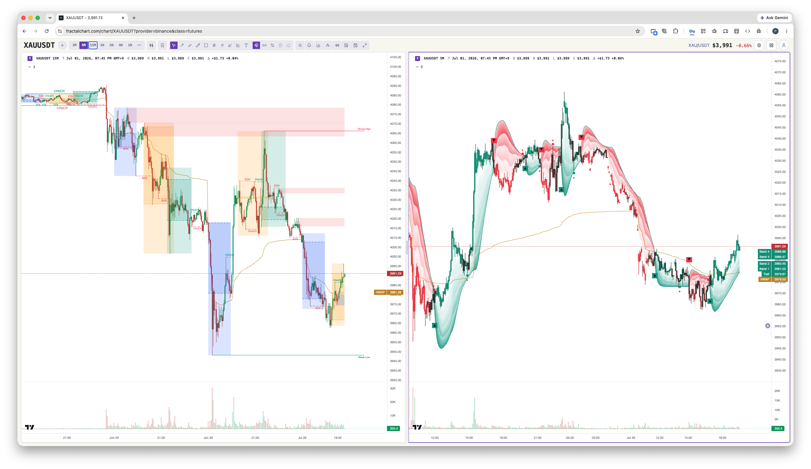

# Piner

[](https://github.com/heyphat/piner/actions/workflows/ci.yml)
[](https://www.npmjs.com/package/@heyphat/piner)
[](./LICENSE)

A clean-room **Pine Script v6** engine in TypeScript — compile and run Pine
indicators and strategies anywhere, browser-first. Designed from the public
TradingView v6 docs only.

Piner is the engine behind [fractalchart.com](https://fractalchart.com), which
is its primary use case, and it's published here as a standalone open-source
library.



> `compile(src)` lexes → parses → analyzes → emits JS **and** an interpreter
> oracle; the two backends are cross-checked for byte-for-byte identical output.
> The full v6 language runs end-to-end, plus broad built-in, input, drawing,
> `request.security`, and `strategy` coverage. See
> [`docs/compiler-design.md`](./docs/compiler-design.md).

## Documentation

All docs live in [`docs/`](./docs/README.md):

- **[Architecture](./docs/architecture.md)** — the engine design.
- **[Pine semantics](./docs/pine-semantics.md)** — the v6 spec the engine implements.

## Install

```bash
npm install @heyphat/piner
# or: bun add @heyphat/piner / pnpm add @heyphat/piner / yarn add @heyphat/piner
```

Ships ESM + CJS builds and TypeScript types. Works in the browser and in Node ≥ 18.

## Develop

Requires [Bun](https://bun.sh) ≥ 1.2.

```bash
bun install
bun test          # full suite incl. the two-backend (js vs interp) cross-check
bun run typecheck # tsc --noEmit
bun run build     # ESM + CJS (bun) + d.ts (tsc) into dist/
```

See [CONTRIBUTING.md](./CONTRIBUTING.md) for the clean-room policy and the
two-backend invariant before opening a PR.

## What works today

Compile Pine v6 source and run it against a data feed:

```ts
import { compile, Engine, ArrayFeed } from '@heyphat/piner';

const compiled = compile(`//@version=6
indicator("SMA cross", overlay=true)
fast = ta.sma(close, 5)
slow = ta.sma(close, 20)
plot(fast, title="fast")
plot(slow, title="slow")
plotshape(ta.crossover(fast, slow), title="up")
`);

const engine = new Engine(compiled, new ArrayFeed(bars)); // backend: 'js' (default) | 'interp'
await engine.run({ symbol: 'BTCUSD', timeframe: '60' });
engine.outputs.plots.get(0); // → { id, title, data: number[] }

// realtime: each tick re-runs the open bar (repaint), commit on close
engine.tick(liveBar, /* isClose */ false);
```

`compiled.interpret` is the AST-interpreter backend over the same runtime — used
as the correctness oracle (cross-checked against the generated JS). The runtime
can also execute a hand-written `ScriptFn` directly (see `test/runtime-core.test.ts`).

## Contributing

Contributions are welcome — bug reports, fixes, new built-in coverage, and docs.
Please read [CONTRIBUTING.md](./CONTRIBUTING.md) (especially the clean-room
policy) and the [Code of Conduct](./CODE_OF_CONDUCT.md) first.

## License

[GNU AGPL-3.0](./LICENSE) © Phat Huynh.

Piner is a clean-room reimplementation from public TradingView documentation. No
third-party Pine engine code is used or copied.
